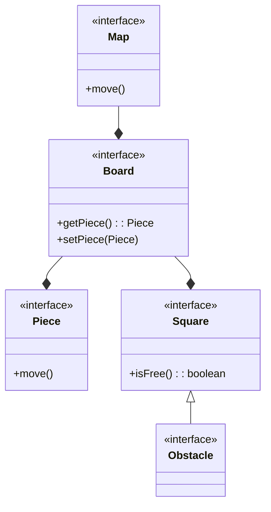
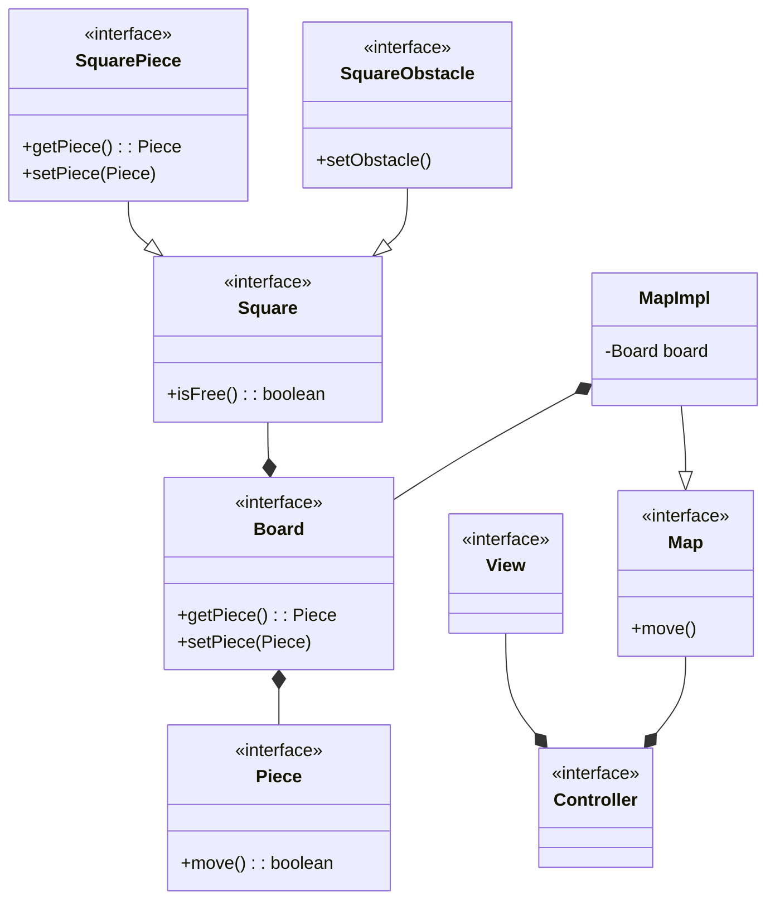
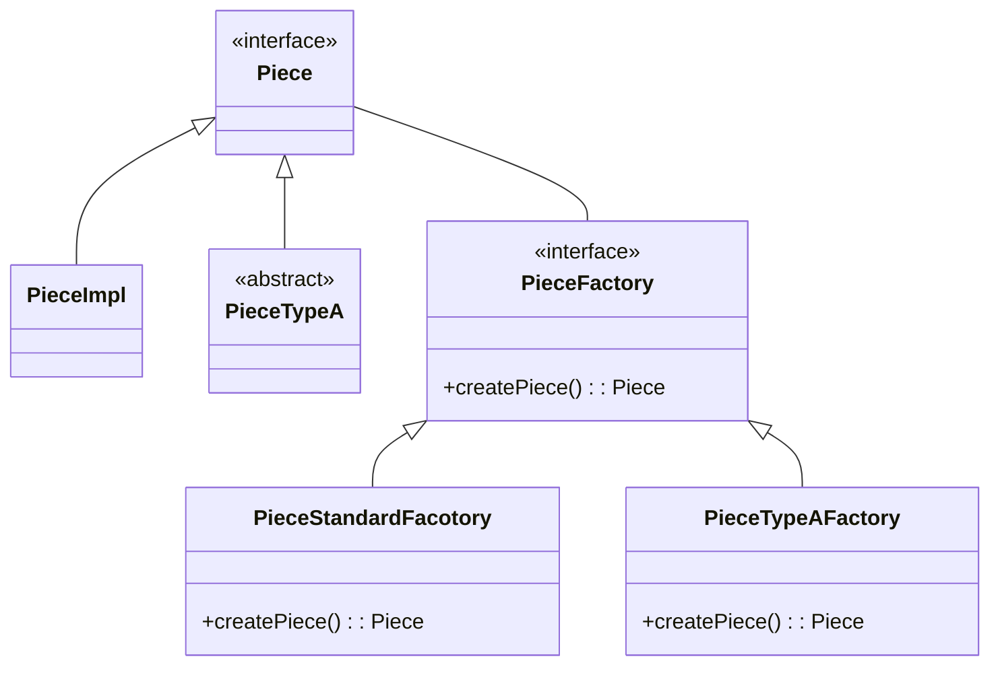
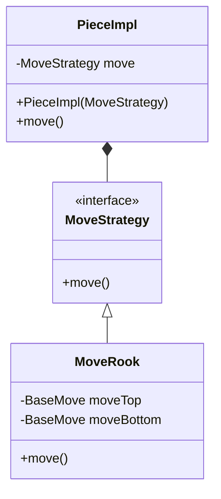
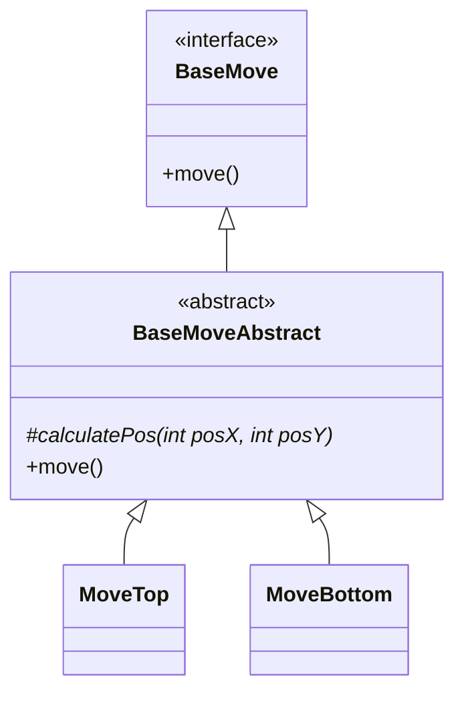
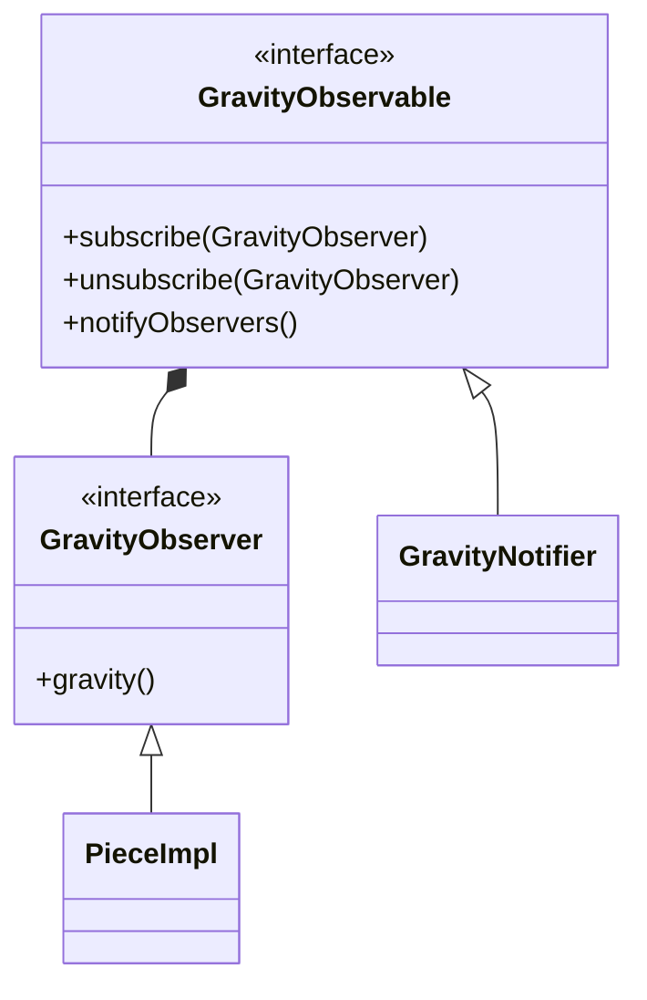

# pss23-24-ChessGravity-Arrighi

# Analisi

## Requisiti

Il software miara alla realizzazione di un gioco di “puzzle di scacchi”: i pezzi si muovono non solo rispettando le regole standard degli scacchi ma anche subendo l’effetto della forza di gravità. Quando un pezzo viene mosso, una volta arrivato nella casa di destinazione, questo comincia a cadere verso il basso fino a che incontra un ostacolo o un altro pezzo che lo blocca. Ogni livello si sviluppa all'interno di una mappa: una normale scacchiera in aggiunta ad una combinazione di ostacoli. I pezzi sono differenti per ogni livello, sia di numero che di tipologia.

Scopo del gioco è scoprire all’interno della mappa, tramite una serie di combinazioni, la via per catturare il re avversario. Questo sarà l'unico pezzo avversario e sarà immobile per l'intera durata del livello: le uniche mosse saranno quelle del giocatore.

### Definizione dei termini
-  Pezzi: "personaggi" che compongono il gioco (pedone, alfiere, cavallo, torre, regina, re)
-  Casa: singola unità che compone la scacchiera. Su ogni casa può esservi un solo pezzo alla volta.
-  Ostacolo: unità situata in una casa con lo scopo di bloccare il transito di un pezzo.

### Requisiti funzionali
-  Ogni pezzo presente nella mappa deve potersi muovere liberamente seguendo le regole degli scacchi.
-  Qualora un pezzo dovesse trovare un ostacolo o un altro pezzo nel suo percorso, il suo movimento verrà negato.
-  Dopo aver completato il tragitto di un pezzo (dalla casa di partenza alla casa di destinazione), questo cadrà verso il basso sino ad "atterrare" nella prima casa utilie. La casa soprastante un pezzo o un ostacolo; in alternativa la base della scacchiera.
-  Il re avversario deve poter essere catturato con un qualsiasi pezzo posizionato nella sua medesima casa.

### Requisiti non funzionali
-  Menù di navigazione per la scelta del livello.
-  Generazione dinamica delle mappe per ogni livello.

## Analisi e modello del dominio

Ogni livello è cosituito da una mappa (Map) questa è formata da: una scacchiera (Board), un insieme di ostacoli (Obstacle) e i pezzi(Piece). La scacchiera sarà costituita da un insieme di case (Square). Ad ogni casa può essere associato un solo elemento per volta, che può essere: un pezzo o un ostacolo. Ogni pezzo presente sulla scacchiera può essere spostato (Movement) in una casa di destinazione (se conforme alle regole del gioco). Completato il movimento il pezzo "cadrà" verso il basso per la "gravità" (Gravity)

Map - Board - Square - Piece - Obstacle - Movement

Map -Composizione- Board
Map -Composizione- Obstacle
Map -Composizione- Piece
Board -Composizione- Square
Square -Associazione- Piece
Square -Associazione- Obstacle
Piece -Associazione- Movement
Movment -Aggregazione- Square
Gravity -Composizione- Piece




Le dificcoltà da gestire saranno:
-  Le interazioni tra i pezzi e le case della scacchiera in modo efficiente. Allo stesso tempo mantenere la consistenza dei dati.
-  La modularità ed il riuso dei movimenti e della gravità.

I requisiti non funzionali tali menù di navigazione e generazione dinamica della mappa non sarà possibile implementarli setando nel monte ore previsto.

# Design

## Architettura

L'archiettura adottata segue le regole del pattern MVC. In questo caso il modello si sviluppa partendo da Map. Da qui è possibile accedere allo stato di tutta la logica applicativa del software. Map è un'interfaccia che viene implementata da MapImpl. Così facendo è possibile astrarre quando si va ad utilizzare il modello è possibile astrarre dall'implementazione e lavorare solo con il contratto definito. E' perciò possible, con futuri aggiornamenti, implementare diverse versioni di Map. Più in dettaglio sono state modellate due tipologie Square una per gli ostacoli, che essendo "statici" (non hanno un comportamento specifico ma definiscono solo uno stato di Square), possono essere definiti come una specializzazione di Square. Per le altre dove si ottiene un dinamismo dovuto dallo spostamento dei pezzi, si è creato un sotto tipo specifico per gestire tutte le interazione tra Square e Piece.



## Design dettagliato

### Creazione dei pezzi

Rappresentazione del pattern Factory Method per la creazione dei pezzi.



#### Problema

Il problema riscontrato durante la fase di sviluppo è stato quello di gestire i numerosi tipi di oggetti da creare per
modellare ogni tipo di pezzo del gioco (re, regina, torre...). Inoltre in fase di analisi si è riscontrato alla futura possibilità di aggiunta di nuove "categorie" di pezzi con differenti aspetti da quelli standard degli scacchi.

#### Soluzione

La soulzione adottata è stata quelal di utilizzare il pattern Factory Method, in particolare la versione parametrizzata. Questo è servito per semplificare l'aspetto di creazione dei pezzi andando a creare una classe specifica che si occupasse solamente di questo. Inoltre, la tipologia adottata, Factory Metohd Parametrized, applica gestione della creazioni di oggetti suddivisi in gruppi per ogni classe Factory. Il pattern è stato adottao in visione delle possibile aggiunte al software di nuove tipologie di pezzi. Così facendo ogni classe sarà responsabile della creazione dei pezzi facenti parte solamente di un singolo gruppo.
In questo momento l'interfaccia che definsice il contratto d'uso della classe Factory è la PieceFactory. La classe responsabile della creazione dei pezzi standard è la PieceStandardFactory. Con la parametrizzazione viene quindi creata una specifica istanza della classe PieceImpl.

### Gestione dei movimenti dei pezzi

Rappresentazione UML dello Strategy pattern per la gesione degli algoritmi di movimento.



#### Problema

Ogni pezzo deve essere costituito da un movimento differente dagli altri. Serve gestire in modo dinamico il tipo di movimento necessario per il pezzo richiesto.

#### Soluzione

La soluzione adottata è lo Strategy pattern: l'interfaccia MoveStrategy definisce il contratto d'uso per una strategia. Questa è implementata da tutti i tipi di movemineti dei pezzi. In questo caso la dinamicità viene a presentarsi solo in fase di creazione di un pezzo. E' comunque utile applicare il pattern in questo caso, per incapsulare il movimento in una classe separata dai pezzi. Così i movimenti sono modulari mantendo il principio del single responsability principle. Con futuri aggiornamenti al software, è inoltre possibile riutilizzare il codice sviluppato.

#### Note

In fase di sviluppo si è riscontrato che, alcune classi avessero parti implementative duplicate. E' stata valutata la possibilità di aggiungere una classe astratta, con cui applicare un Template method pattern. La scelta è stata scarta per evitara una eccessiva complicazione del software. Con aggiornamenti futuri, nel caso di aggiunte di classi con codice duplicato, l'approccio al problema potrebbe essere quello analizzato.

### Movimenti di base

Rappresentazione UML dei movimenti di base.



#### Problema

In fase di implementazione è stato riscontrato una eccessiva duplicazione del codice per i movimenti. I movimenti dei pezzi sono di fatto una composizione di micro movimenti consecutivi l'uno all'atro. Di conseguenza molti micro movimenti sono uguali per diversi pezzi, causando un'eccessiva duplicazione del codice.

#### Soluzione

Per risolvere questo problema è stata creata una porzione del software specifica solo per implementare questi micro movimenti. In questo modo ogni movimento di un pezzo (MoveStrategy) è composto da un insieme di queste classi. Così facendo si è diminuita la duplicazione di codice e aumentato il riuso.
La souluzione di design adottata è il Template Method pattern: la classe astratta BaseMoveAbstract implementa il metodo template move e la classe che estende, implementa il metodo astratto calculatePos. In questo modo tutte le parti comuni vengono implementate nella classe astratta, mentre ogni classe concreata implementa lo specifico micro movimento. Si ottiene così una minore duplicazione del codice delegando la responsabilità del calcolo dello spostamento ad ogni classe concreta.

### Notifica della gravità

Rappresentazione UML del sistema di notifica della gravità.



#### Problema

Il problema riscontrato è stato quello di gestire la gravità di tutti i pezzi coinvolti a seguito di un movimento di un pezzo. Dopo che un pezzo è stato mosso, vi è la possibilità che la gestione gravità dei pezzi non sia solamente del pezzo appena mosso. In alcuni casi, quando il pezzo appena mosso risiede sotto altri pezzi, è necessario gravitare anche tutti i pezzi soprastanti. In assenza di ciò, tutti i pezzi in causa rimerrebbero "volanti" nella scacchiera.


#### Soluzione

La soluzione adottata è il pattern Observer: l'interfaccia che definisce un observer è la GravityObserver, mentre l'interfaccia che definisce l'observable è GravityObservable. In questo scenario la classe observer che implementana l'interfaccia è PieceImpl, colei che deve essere avvisata dell'avvenuto cambio di stato di un pezzo e di conseguenza è necessario chiamare il metodo gravity. La classe che implementa l'observable è la classe GravityNotifier. Il pattern è stato applicato con una modifica rispetto alla sua versione standard. La classe observable si occupa di notificare solo una parte degli observer assegnati. Questo perchè gli observer da notificare sono solamente i pezzi posizionati al di sopra del pezzo mosso. Così si riducono i cilci di esecuzione ed allo stesso tempo si applica una migliore semantica al codice.

# Sviluppo

## Testing automatizzato

Il progetto è stato intergrato con un sistema di testing completamente automatizzato grazie all'ausilio di juinit.

### Premessa

In tutti i test, ove possibile, sono state create delle classi "mock" per rendere il più possibile isolati i test. In questo modo si evita l'utilizzo di codice esterno alla classe da testare, restringendo il controllo solo alla classe specifica.

### Componenti sottoposti ai test

- BoardImpl: classe stata testa per verificare la corretta creazione e composizione delle case che compongono la scacchiera. In aggiunta viene testato anche la corretta gestione dei posizionamenti e delle collisioni dei pezzi.
- GravityNotifier: classe testa per verificare che i pezzi vengano notificati nell'ordine corretto.
- MoveStrategy: tutte le classi che implementano l'interfaccia strategy sono state testate per verificare il corretto funzionamento dell'algoritmo di movimento.
- BaseMoveAbstract: classe testata per verificare il corretto funzionamento del metodo template. In particolare che questo utilizzi correttamente il metodo astratto in aggiunta al controllo di posizionamento.
- GravityImpl: classe testata per controllare il corretto funzionamento dell'algoritmo di gravità.
- Position: classe testata per controllare il corretto funzionamento di conversione delle posizioni tra model e view.

## Note di sviluppo

### Utilizzo di Stream per la manipolazione di collezioni

**Dove** molte classi, ad esempio `it.unibo.chessgravity.model.impl.GravityNotifier`

**Snippet**
```java
@Override
public List<GravityObserver> notifyObservers(final SquarePosition pos) {
    final int posX = pos.getPosX();
    final int posY = pos.getPosY();
    final List<GravityObserver> res;

    res = observers.parallelStream()
    .filter(x -> x.getPos().getPosX() == posX)
    .filter(x -> x.getPos().getPosY() > posY)
    .sorted((a, b) -> {
        return Integer.compare(
            a.getPos().getPosY(),
            b.getPos().getPosY()
        );
    })
    .toList();
    
    res.forEach(x -> x.gravity());

    return res;
}
```

### Utilizzo di un'interfaccia funzionale per lambda funtion

**Dove**: `it.unibo.chessgravity.model.impl.move.base.BaseMoveAbstract`

**Snippet**:
```java
public interface MoveChecker {
    MoveResponse checkMove(SquarePosition pos, Board board);
}

public BaseMoveAbstract(final MoveChecker cheker) {
    this.checker = cheker;
}

@Override
public MoveResponse move(final SquarePosition start, final Board board) {
    final SquarePosition pos = calculatePos(start.getPosX(), start.getPosY());

    return checker.checkMove(pos, board);
}
```

### Utilizzo di enumerazioni

**Dove**: `it.unibo.chessgravity.model.utils.PieceType`

**Snippet**:
```java
public enum PieceType {
    KING(STANDARD), 
    QUEEN(STANDARD),
    ROOK(STANDARD),
    BISHOP(STANDARD),
    KNIGHT(STANDARD);

    private final PieceGroup group;

    private PieceType(final PieceGroup group) {
        this.group = group;
    }

    public PieceGroup getGroup() {
        return this.group;
    }
}
```

# Commenti finali

## Autovalutazione lavori futuri

Punti di forza:
-  Buona fase di analisi e progettazione del software.
-  Applicazione di diversi design pattern.
-  Isolamento dei componenti.

Punti di debolezza:
-  Alcune classi non sono ben congegnate.
-  Non tutte le classi rispettano il single responsability principle.
-  Eccessivo accoppiamento tra le classi dei movimenti.

## Difficoltà riscontrate

-  Comprensione di quale sia la migliore modellazione da adottare per uno specifico aspetto del dominio in analisi.
-  Gestire in modo corretto le relazioni tra le entità del prorpio dominio.

## Guida utente

Per utilizzare l'applicativo ci si aspetta la conoscenza pregressa delle regole di movimento dei pezzi degli scacchi. Per muovere è necessario un "single click" su un pezzo e poi un altro "single click" sulla casa di destinazione a cui si vuole arrivare. Il gioco si completa spostando un pezzo nella casa in cui si trova il re nemico.