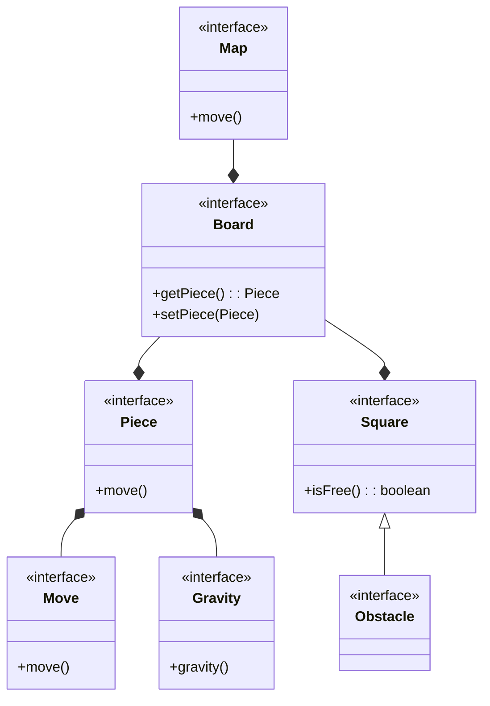

# pss23-24-ChessGravity-Arrighi

# Analisi

## Requisiti

Il software mira alla realizzazione di un gioco di “puzzle di scacchi”: i pezzi si muovono, non solo rispettando le regole standard degli scacchi, ma anche subendo l’effetto della forza di gravità. 

Quando un pezzo viene mosso, una volta arrivato nella casa di destinazione, questo comincia a cadere verso il basso, fino a che incontra un ostacolo o un altro pezzo che lo blocca. Ogni livello si sviluppa all'interno di una mappa: una normale scacchiera in aggiunta ad una combinazione di ostacoli. I pezzi sono differenti per ogni livello, sia di numero sia di tipologia.

Scopo del gioco è scoprire all’interno della mappa, tramite una serie di combinazioni, la via per catturare il re avversario. Questo sarà l'unico pezzo avversario e sarà immobile per l'intera durata del livello: le uniche mosse saranno quelle del giocatore.

### Definizione dei termini
-  Pezzi: "personaggi" che compongono il gioco (pedone, alfiere, cavallo, torre, regina, re)
-  Casa: singola unità che compone la scacchiera. Su ogni casa può esservi un solo pezzo alla volta.
-  Ostacolo: unità situata in una casa con lo scopo di bloccare il transito di un pezzo.

### Requisiti funzionali
-  Ogni pezzo presente nella mappa deve potersi muovere liberamente seguendo le regole degli scacchi.
-  Qualora un pezzo dovesse trovare un ostacolo o un altro pezzo nel suo percorso, il suo movimento verrà negato.
-  Il pezzo, mosso dal giocatore, arriva nella casa selezionata. Nel caso in cui non ci sia un'appoggio, comincia a cadere verso il basso. La sua caduta termina quando incontra: un ostacolo o un altro pezzo o la base della scacchiera.
-  Il re avversario deve poter essere catturato con un qualsiasi pezzo posizionato nella sua stessa casa.

### Requisiti non funzionali
-  Menù di navigazione per la scelta del livello.
-  Generazione dinamica delle mappe per ogni livello.

## Analisi e modello del dominio

Ogni livello è cosituito da una mappa (Map) formata da: 
-  una scacchiera (Board). 
-  un insieme di ostacoli (Obstacle)
-  un insieme di pezzi (Piece). 

La scacchiera sarà costituita da un insieme di case (Square). Ad ogni casa può essere associato un solo elemento per volta, che può essere un pezzo o un ostacolo. Ogni pezzo presente sulla scacchiera può essere spostato (Move) in una casa di destinazione (se conforme alle regole del gioco). Completato il movimento il pezzo "cadrà" verso il basso per la "gravità" (Gravity)




Le dificcoltà da gestire saranno:
-  Gestire le interazioni tra i pezzi e le case della scacchiera in modo efficiente.
-  Mantenere la consistenza dei dati.
-  Progettare i movimenti e la gravità, affinché siano modulari e perciò promuovere il riuso.

Restando nel monte ore previsto, non sarà possibile implementare i requisiti non funzionali (il menù di navigazione e la generazione dinamica della mappa).

# Design

## Architettura

L'archiettura adottata segue le regole del pattern MVC. In questo caso il modello si sviluppa partendo da Map. Da qui si accede a tutto lo stato applicativo del modello. 

Map è un'interfaccia che viene implementata da MapImpl. In questo modo si può astrarre dall'implementazione della mappa e lavorare solo con il contratto d'uso definito. E' perciò possible, con futuri aggiornamenti, implementare diverse versioni di Map. 

Sono state modellate due sottotipi di `Square`: uno per gli ostacoli e uno per le case che possono ospitare un pezzo. Allo stato attuale della progettazione del software, `SquareObstacle` risulta essere solamente un "place holder" per indicare la presenza di un ostacolo. Essi, infatti, non ricoprono altre funzionalità specifiche. Si è però deciso di modellare il problema, pensando a futuri aggiornamenti, con cui aggiungere altre specializzazioni di `SquareObstacle`.

L'interfaccia grafica verrà gestita nella parte della "view". Seguendo i principi del pattern "MVC", la "view", a seguito di input dell'utente, contatterà il "controller" per ottenere in risposta informazioni generate da `Map` (modello).


## Design dettagliato

### Creazione dei pezzi

Rappresentazione UML del pattern Factory Method per la creazione dei pezzi.


#### Problema

Durante la fase di sviluppo, si sono presentati alcuni problemi nella creazione delle istanze dei pezzi che compongono il gioco (re, regina, torre...). 

Inoltre, in fase di analisi, è stata riscontrata la possibilità di aggiungere nuove "categorie" di pezzi, con aspetti differenti da quelli standard degli scacchi.

#### Soluzione

La soulzione adottata è stata quella di utilizzare il pattern Factory Method, in particolare la versione parametrizzata. L'interfaccia, che definsice il contratto d'uso della "factory", è la PieceFactory. La classe responsabile della creazione dei pezzi è la PieceStandardFactory.

Questo pattern è servito per semplificare l'aspetto di creazione dei pezzi, andando a definire una classe specifica, che si occupasse solamente di questo. Inoltre, la tipologia di pattern adottata, Factory Metohd Parametrized, gestisce la creazioni di oggetti, suddividendoli in gruppi per ogni classe "factory". Questo pattern è stato adottato, nella prospettiva di aggiungere nuove tipologie di pezzi. Così facendo, ogni classe "factory" sarà responsabile della creazione dei pezzi di un singolo gruppo.
Con la parametrizzazione, PieceStandardFactory è in grado di creare una specifica istanza di PieceImpl.

### Gestione dei movimenti dei pezzi

Rappresentazione UML dello Strategy pattern per la gesione degli algoritmi di movimento.


#### Problema

Ogni tipo di pezzo deve essere costituito dal suo specifico movimento. Servono perciò differenti versioni di movimento (strategie) per ogni tipologia di pezzo.

#### Soluzione

La soluzione adottata è lo Strategy pattern: l'interfaccia MoveStrategy definisce il contratto d'uso per una strategia. Questa è implementata da tutti i tipi di movemineti dei pezzi. In questo caso la dinamicità viene a presentarsi solo in fase di creazione di un pezzo. E' comunque utile applicare il pattern, poiché si va ad incapsulare il movimento in una classe separata dai pezzi. Così i movimenti sono modulari, mantendo il principio del single responsability principle. Con futuri aggiornamenti al software, è inoltre possibile riutilizzare il codice sviluppato.

#### Note

In fase di sviluppo, si è riscontrato che alcune classi avessero parti implementative duplicate. E' stata valutata la possibilità di aggiungere una classe astratta, con cui applicare un Template method pattern. La scelta non è stata applicata, per evitara un'eccessiva complicazione del software. La soluzione del problema, nel caso di nuove implementazoni con codice duplicato, potrebbe essere quella analizzata.

### Movimenti di base

Rappresentazione UML dei movimenti di base.


#### Problema

In fase di implementazione è stato riscontrato un'eccessiva duplicazione del codice per i movimenti. Questi sono di fatto una composizione di "micro-movimenti" consecutivi l'uno all'atro che si ripetono in molti pezzi.

#### Soluzione

Per risolvere questo problema, è stata creata una porzione del software specifica solo per implementare questi "micro-movimenti". In questo modo, ogni spostamento di un pezzo (MoveStrategy) è composto da un insieme di queste classi. Così facendo, si è diminuita la duplicazione di codice e aumentato il riuso.

La souluzione di design adottata è il Template Method pattern: la classe astratta BaseMoveAbstract implementa il metodo template `move`. La classe concreata implementa il metodo astratto `calculatePos`. In questo modo, tutte le parti comuni vengono implementate nella classe astratta, mentre ogni classe concreata implementa lo specifico "micro-movimento". Si ottiene così una minore duplicazione del codice, delegando la responsabilità del calcolo dello spostamento ad ogni classe concreta.

### Notifica della gravità

Rappresentazione UML del sistema di notifica della gravità.


#### Problema

Il problema riscontrato è stato quello di gestire la gravità, a seguito di un movimento. Infatti, quando il pezzo mosso è sottostante ad altri, è necessario applicare a tutti la gravità. In assenza di ciò, tutti i pezzi in causa rimerrebbero "volanti" nella scacchiera.

#### Soluzione

La soluzione adottata è il pattern Observer: l'interfaccia che definisce un observer è la GravityObserver, mentre l'interfaccia che definisce l'observable è GravityObservable. 

In questo scenario la classe observer che implementana l'interfaccia è PieceImpl. Questa deve essere avvisata dell'avvenuto cambio di stato di un pezzo. A seguito di ciò, interviene la chiamata al metodo `gravity`. 

La classe, che implementa l'observable, è GravityNotifier. Rispetto alla sua "versione" standard, il pattern è stato applicato con una modifica. La classe observable si occupa di notificare solo una parte degli observer assegnati. Questo perchè gli observer da notificare sono solamente i pezzi posizionati al di sopra del pezzo mosso. Così facendo, si riducono i cilci di esecuzione ed allo stesso tempo si applica una migliore semantica al codice.

# Sviluppo

## Testing automatizzato

Il progetto è stato intergrato con un sistema di testing completamente automatizzato grazie all'ausilio di juinit.

### Premessa

In tutti i test, ove possibile, sono state create delle classi "mock", per rendere il più possibile isolati i test. In questo modo, si evita l'utilizzo di codice "esterno" da quello della classe da testare, restringendo così le verifiche.

### Componenti sottoposti ai test

- BoardImpl: classe testata per verificare la corretta creazione e composizione delle case, che compongono la scacchiera. In aggiunta viene testata anche la corretta gestione dei posizionamenti e delle collisioni dei pezzi.
- GravityNotifier: classe testata per verificare che i pezzi vengano notificati nell'ordine corretto.
- MoveStrategy: tutte le classi che implementano l'interfaccia strategy sono state testate per verificare il corretto funzionamento dell'algoritmo di movimento.
- BaseMoveAbstract: classe testata per verificare il corretto funzionamento del metodo template. In particolare deve utilizzare correttamente il proprio metodo astratto e verificare la posizione in esame.
- GravityImpl: classe testata per controllare il corretto funzionamento dell'algoritmo di gravità.
- Position: classe testata per controllare il corretto funzionamento di conversione delle posizioni tra model e view.

## Note di sviluppo

### Utilizzo di Stream per la manipolazione di collezioni

**Dove** molte classi, ad esempio `it.unibo.chessgravity.model.impl.GravityNotifier`

**Snippet**
```java
@Override
public List<GravityObserver> notifyObservers(final SquarePosition pos) {
    final int posX = pos.getPosX();
    final int posY = pos.getPosY();
    final List<GravityObserver> res;

    res = observers.parallelStream()
    .filter(x -> x.getPos().getPosX() == posX)
    .filter(x -> x.getPos().getPosY() > posY)
    .sorted((a, b) -> {
        return Integer.compare(
            a.getPos().getPosY(),
            b.getPos().getPosY()
        );
    })
    .toList();
    
    res.forEach(x -> x.gravity());

    return res;
}
```

### Utilizzo di un'interfaccia funzionale per lambda funtion

**Dove**: `it.unibo.chessgravity.model.impl.move.base.BaseMoveAbstract`

**Snippet**:
```java
public interface MoveChecker {
    MoveResponse checkMove(SquarePosition pos, Board board);
}

public BaseMoveAbstract(final MoveChecker cheker) {
    this.checker = cheker;
}

@Override
public MoveResponse move(final SquarePosition start, final Board board) {
    final SquarePosition pos = calculatePos(start.getPosX(), start.getPosY());

    return checker.checkMove(pos, board);
}
```

### Utilizzo di enumerazioni

**Dove**: `it.unibo.chessgravity.model.utils.PieceType`

**Snippet**:
```java
public enum PieceType {
    KING(STANDARD), 
    QUEEN(STANDARD),
    ROOK(STANDARD),
    BISHOP(STANDARD),
    KNIGHT(STANDARD);

    private final PieceGroup group;

    private PieceType(final PieceGroup group) {
        this.group = group;
    }

    public PieceGroup getGroup() {
        return this.group;
    }
}
```

# Commenti finali

## Autovalutazione lavori futuri

Punti di forza:
-  Buona fase di analisi e progettazione del software;
-  Applicazione di diversi design pattern;
-  Isolamento dei componenti.

Punti di debolezza:
-  Alcune classi non sono ben congegnate;
-  Non tutte le classi rispettano il single responsability principle;
-  Eccessivo accoppiamento tra le classi dei movimenti.

## Difficoltà riscontrate

-  Comprendere quale sia la migliore modellazione da adottare per uno specifico aspetto del dominio in analisi.
-  Gestire in modo corretto le relazioni tra le entità del prorpio dominio.

## Guida utente

Per utilizzare l'applicativo è necessaria la conoscenza pregressa delle regole di movimento dei pezzi degli scacchi. Per muovere è necessario un "single click" su un pezzo e poi un altro "single click" sulla casa di destinazione. Il gioco si completa con la cattura del re, ossia il posizionamento di un proprio pezzo nella sua casa.