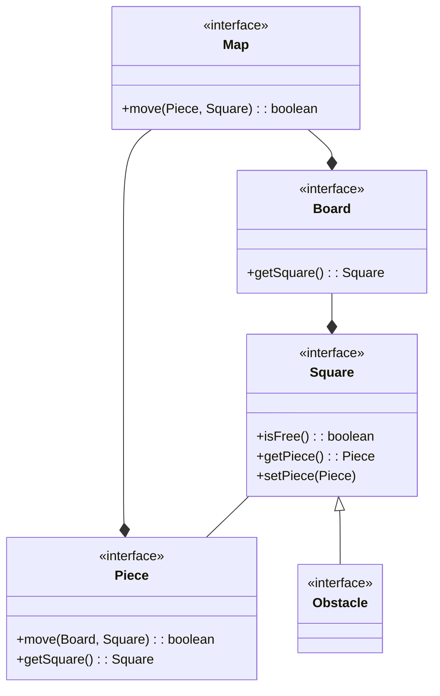
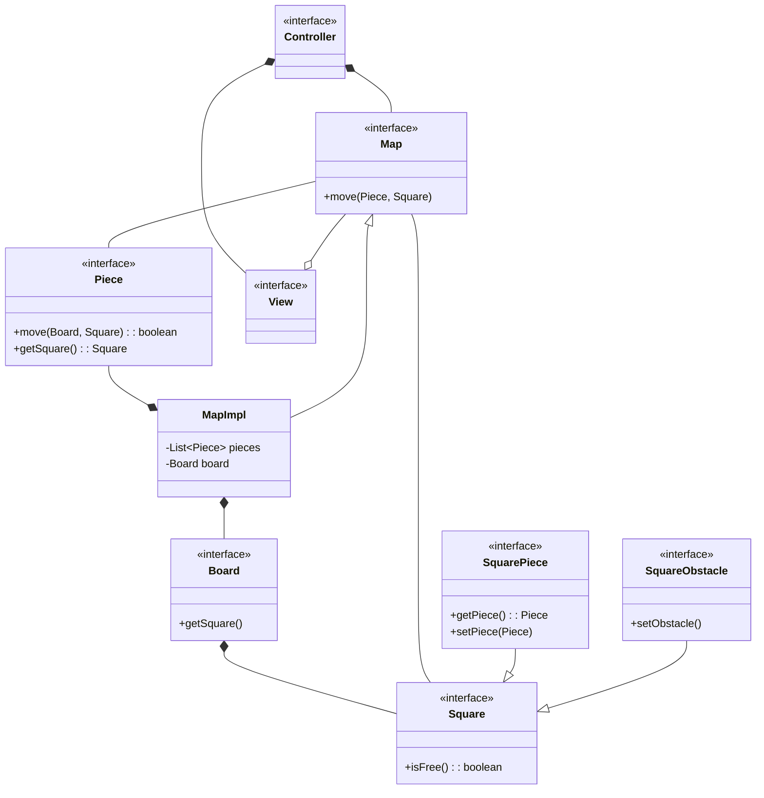
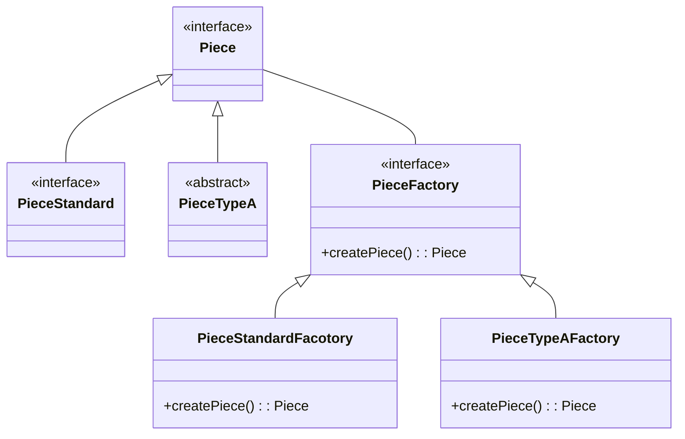
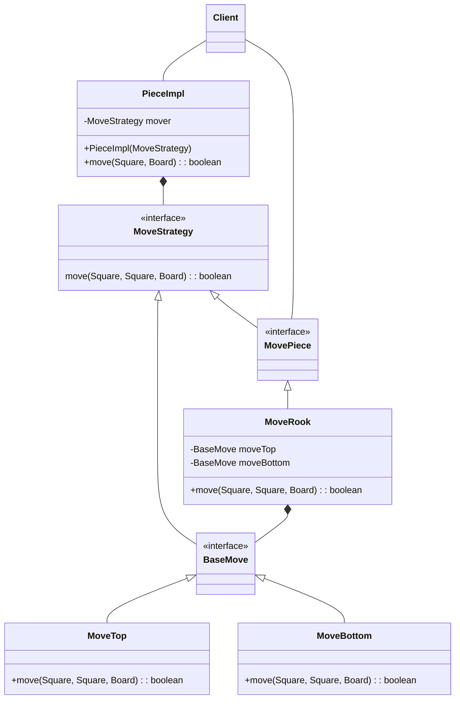

# pss23-24-ChessGravity-Arrighi

# Analisi

## Requisiti

Il software miara alla realizzazione di un gioco di “puzzle di scacchi”: i pezzi si muovono non solo rispettando le regole standard degli scacchi ma anche subendo l’effetto della forza di gravità. Quando un pezzo viene mosso, una volta arrivato nella casa di destinazione, questo comincia a cadere verso il basso fino a che incontra un ostacolo o un altro pezzo che lo blocca. Ogni livello si sviluppa all'interno di una mappa: una normale scacchiera in aggiunta ad una combinazione di ostacoli. I pezzi sono differenti per ogni livello, sia di numero che di tipologia.

Scopo del gioco è scoprire all’interno della mappa, tramite una serie di combinazioni, la via per catturare il re avversario. Questo sarà l'unico pezzo avversario e sarà immobile per l'intera durata del livello: le uniche mosse saranno quelle del giocatore.

### Definizione dei termini
-  Pezzi: "personaggi" che compongono il gioco (pedone, alfiere, cavallo, torre, regina, re)
-  Casa: singola unità che compone la scacchiera. Su ogni casa può esservi un solo pezzo alla volta.
-  Ostacolo: unità situata in una casa con lo scopo di bloccare il transito di un pezzo.

### Requisiti funzionali
-  Ogni pezzo presente nella mappa deve potersi muovere liberamente seguendo le regole degli scacchi.
-  Qualora un pezzo dovesse trovare un ostacolo o un altro pezzo nel suo percorso, il suo movimento verrà negato.
-  Dopo aver completato il tragitto di un pezzo (dalla casa di partenza alla casa di destinazione), questo cadrà verso il basso sino ad "atterrare" nella prima casa utilie. La casa soprastante un pezzo o un ostacolo; in alternativa la base della scacchiera.
-  Il re avversario deve poter essere catturato con un qualsiasi pezzo posizionato nella sua medesima casa.

### Requisiti non funzionali
-  Menù di navigazione per la scelta del livello.
-  Generazione dinamica delle mappe per ogni livello.

## Analisi e modello del dominio

Ogni livello è cosituito da una mappa (Map) questa è formata da: una scacchiera (Board), un insieme di ostacoli (Obstacle) e i pezzi(Piece). La scacchiera sarà costituita da un insieme di case (Square). Ad ogni casa può essere associato un solo elemento per volta, che può essere: un pezzo o un ostacolo. Ogni pezzo presente sulla scacchiera può essere spostato (Movement) in una casa di destinazione (se conforme alle regole del gioco). Completato il movimento il pezzo "cadrà" verso il basso per la "gravità" (Gravity)

Map - Board - Square - Piece - Obstacle - Movement

Map -Composizione- Board
Map -Composizione- Obstacle
Map -Composizione- Piece
Board -Composizione- Square
Square -Associazione- Piece
Square -Associazione- Obstacle
Piece -Associazione- Movement
Movment -Aggregazione- Square
Gravity -Composizione- Piece

Le dificcoltà da gestire saranno:
-  Le interazioni tra i pezzi e le case della scacchiera in modo efficiente. Allo stesso tempo mantenere la consistenza dei dati.
-  La modularità ed il riuso dei movimenti e della gravità.

I requisiti non funzionali tali menù di navigazione e generazione dinamica della mappa non sarà possibile implementarli setando nel monte ore previsto.

# Design

## Architettura

L'archiettura adottata segue le regole del pattern MVC. In questo caso il modello si sviluppa partendo da Map. Da qui è possibile accedere allo stato di tutta la logica applicativa del software. Map è un'interfaccia che viene implementata da MapImpl. Così facendo è possibile astrarre quando si va ad utilizzare il modello è possibile astrarre dall'implementazione e lavorare solo con il contratto definito. E' perciò possible, con futuri aggiornamenti, implementare diverse versioni di Map. Più in dettaglio sono state modellate due tipologie Square una per gli ostacoli, che essendo "statici" (non hanno un comportamento specifico ma definiscono solo uno stato di Square), possono essere definiti come una specializzazione di Square. Per le altre dove si ottiene un dinamismo dovuto dallo spostamento dei pezzi, si è creato un sotto tipo specifico per gestire tutte le interazione tra Square e Piece.

## Design dettagliato

Factory method per la creazione dei pezzi

Strategy pattern per la gestione dinamica dei movimenti dei pezzi

